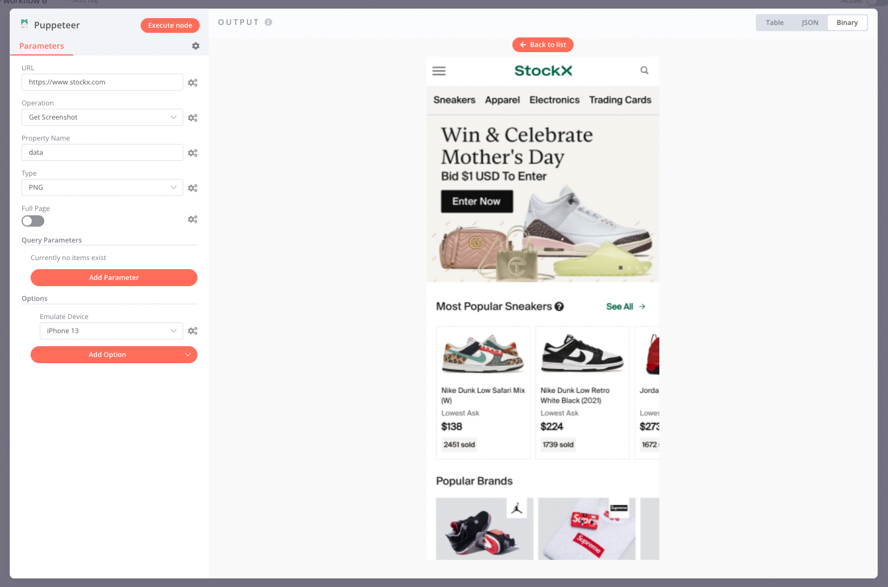

# n8n-nodes-puppeteer

[n8n](https://www.n8n.io) node for requesting webpages using [Puppeteer](https://pptr.dev/), a Node library which provides a high-level API to control Chrome or Chromium over the [DevTools Protocol](https://chromedevtools.github.io/devtools-protocol/). 

## How to install

To get started install the package in your n8n root directory:

`npm install n8n-nodes-puppeteer`

For Docker-based deployments, add the following line before the font installation command in your [n8n Dockerfile](https://github.com/n8n-io/n8n/blob/master/docker/images/n8n/Dockerfile):

`RUN cd /usr/local/lib/node_modules/n8n && npm install n8n-nodes-puppeteer`

> 
> **Note:** If you've having issues running puppeteer, please check their [Troubleshooting guide](https://github.com/puppeteer/puppeteer/blob/main/docs/troubleshooting.md) before opening an issue here.
> 

## Node Reference

* **Operations**
    * Get the full HTML contents of the page
    * Capture screenshot of all or part of the page

* **Options**
    * All Operations
        * **Emulate Device**: Allows you to specify a [device](https://github.com/puppeteer/puppeteer/blob/main/src/common/DeviceDescriptors.ts) to emulate when requesting the page.
        * **Extra Headers**: Allows you add additional headers when requesting the page.
        * **Timeout**: Allows you to specify tge maximum navigation time in milliseconds. You can pass 0 to disable the timeout entirely.
        * **Wait Until**: Allows you to change how Puppeteer considers navigation completed.
            * `load`: The load event is fired.
            * `DOMContentLoaded`: The DOMContentLoaded event is fired.
            * `networkidle0`: No more than 0 connections for at least 500 ms.
            * `networkidle2`: No more than 2 connections for at least 500 ms.
        * **Page Caching**: Allows you to toggle whether pages should be cached when requesting.
        * **Headless mode**: Allows you to change whether to run browser runs in headless mode or not.
        * **Stealth mode**: When enabled, applies various techniques to make detection of headless Puppeteer harder. Powered by [puppeteer-extra-plugin-stealth](https://github.com/berstend/puppeteer-extra/tree/master/packages/puppeteer-extra-plugin-stealth).
    * Get Screenshot
        * **File Name**: Allows you to specify the filename of the output file.
        * **Type** field: Allows you to specify the image format of the output file:
            * JPEG
            * PNG
            * WebP
        * **Quality**: Allows you to specify the quality of the image.
            * Accepts a value between 0-100.
            * Not applicable to PNG images.
        * **Full Page**: Allows you to capture a screen of the full scrollable content.

## Screenshots

### Get Page Content

### Get Screenshot

## License

MIT License

Copyright (c) 2022 Nicholas Penree <nick@penree.com>

Permission is hereby granted, free of charge, to any person obtaining a copy
of this software and associated documentation files (the "Software"), to deal
in the Software without restriction, including without limitation the rights
to use, copy, modify, merge, publish, distribute, sublicense, and/or sell
copies of the Software, and to permit persons to whom the Software is
furnished to do so, subject to the following conditions:

The above copyright notice and this permission notice shall be included in all
copies or substantial portions of the Software.

THE SOFTWARE IS PROVIDED "AS IS", WITHOUT WARRANTY OF ANY KIND, EXPRESS OR
IMPLIED, INCLUDING BUT NOT LIMITED TO THE WARRANTIES OF MERCHANTABILITY,
FITNESS FOR A PARTICULAR PURPOSE AND NONINFRINGEMENT. IN NO EVENT SHALL THE
AUTHORS OR COPYRIGHT HOLDERS BE LIABLE FOR ANY CLAIM, DAMAGES OR OTHER
LIABILITY, WHETHER IN AN ACTION OF CONTRACT, TORT OR OTHERWISE, ARISING FROM,
OUT OF OR IN CONNECTION WITH THE SOFTWARE OR THE USE OR OTHER DEALINGS IN THE
SOFTWARE.